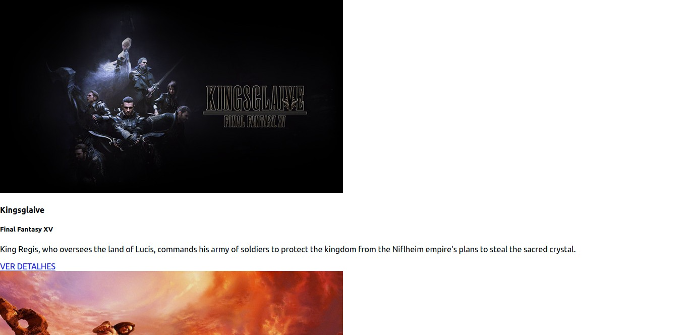

<h1 align="center">
  
</h1>

<h3 align="center">
  Curso realizado na Trybe - Edu Souza o/
</h3>

<blockquote align="center">“A distância pode causar saudades, mas nunca o esquecimento.”</blockquote>

<h4 align="center">
  Repositório - Movie cards library CRUD
</h4>

 

  &nbsp;
  &nbsp;
  

  <a href="#rocket-Sobre-o-projeto">Sobre o projeto</a>&nbsp; &nbsp; |&nbsp; &nbsp;
  <a href="#postbox-Entrega"">Entrega</a>&nbsp; &nbsp; |&nbsp; &nbsp;
  <a href="#unlock-Licença">Licença</a>

## :rocket: Sobre o projeto

#### Movie cards library CRUD

Você vai desenvolver um app que permite criar, atualizar, visualizar e apagar cartões, colocando em prática os conceitos de React Router e lifecycle-methods.
Você deverá implementar um pequeno conjunto de componentes, alguns possuindo estado a ser gerenciado, e combiná-los para criar uma biblioteca de cartões dinâmica. 

#### Screenshots:

   &nbsp;

## :postbox: Entrega

#### :clipboard: Requisitos

- 
<a href="#1"> :pushpin: 1.</a> Rotas: O componente `App` deve renderizar `BrowserRouter`.

- 
<a href="#2"> :pushpin: 2.</a> Movie list: Ao ser montado, `MovieList` deve fazer uma requisição para buscar a lista de filmes a ser renderizada.

- 
<a href="#3"> :pushpin: 3.</a> `MovieCard`: deve possuir um link para a página de detalhes de um filme.

- 
<a href="#4"> :pushpin: 4.</a> `MovieDetails`: deve fazer uma requisição para buscar o filme que deverá ser renderizado.

- 
<a href="#5"> :pushpin: 5.</a> `EditMovie`: deve realizar uma requisição para buscar o filme que será editado.

- 
<a href="#6"> :pushpin: 6.</a> `NewMovie`: Na página inicial, deve haver um link para criar novos cartões..

- 
<a href="#7"> :pushpin: 7.</a> Adicione proptypes a todos os componentes.

- 
<a href="#8"> :pushpin: 8.</a> Adicione um link para deletar um cartão em `MovieDetails`.

  

### Concluído :rocket:

Acesse o deploy do projeto [aqui](https://edusouza-programmer.github.io/Trybe_Projeto_13-3_Edu_Souza/).

#
## :unlock: Licença

Este projeto está licenciado sob a Licença MIT - consulte [LICENSE](https://opensource.org/licenses/MIT) para maiores detalhes.
